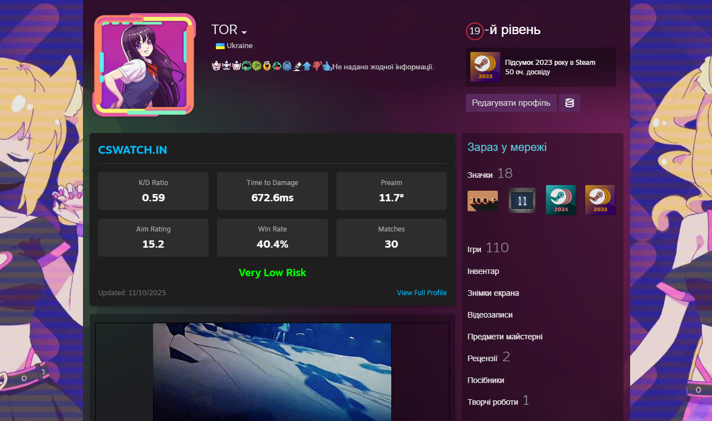
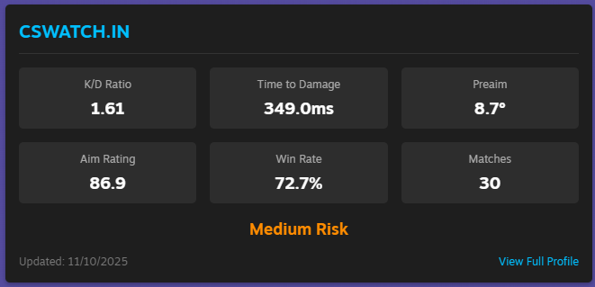
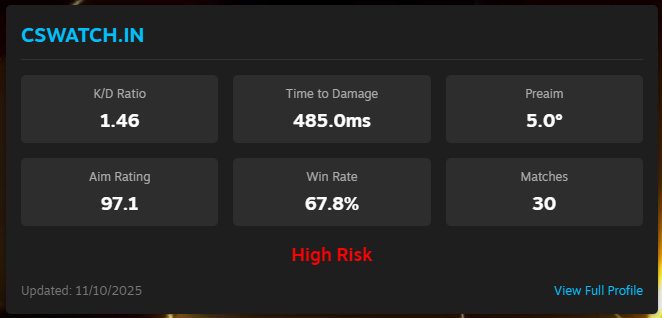
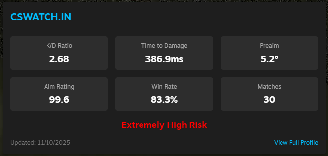

# 

Plugin for viewing statistics from the CSWatch.in website directly in your Steam profile

## 📋 Prerequisites

Before installing this plugin, ensure you have:

-   **[Millennium](https://steambrew.app/)** installed and configured

### Example

---

## 🔗 Links

-   [Millennium Framework](https://github.com/SteamClientHomebrew/Millennium)
-   [CSWatch](https://cswatch.in)
-   [Steam Client](https://store.steampowered.com/about/)
